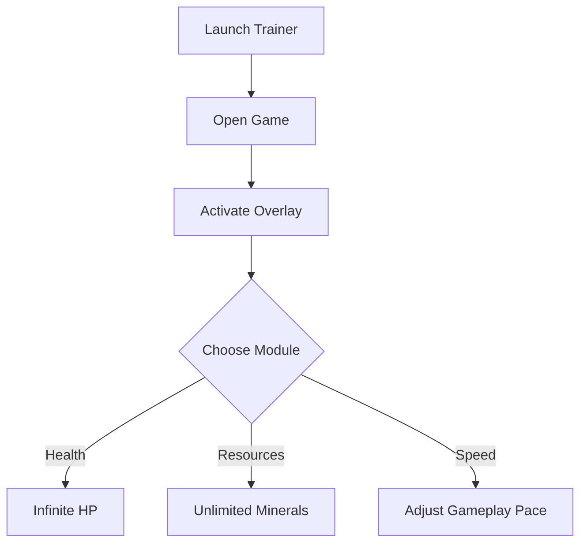

# Deep Rock Galactic: Survivor Trainer ⚒️

The **Deep Rock Galactic: Survivor Trainer** is designed for players who want more freedom to practice, experiment, and explore. With real-time toggles, hotkey configs, and an in-game overlay, you can adjust health, resources, and gameplay speed on the fly.

---

## 📝 Overview

Survival in **Deep Rock Galactic: Survivor** is all about risk versus reward. The trainer gives you the flexibility to **test builds, practice mechanics, and train under custom conditions**—without affecting your permanent saves. Whether you’re farming resources or analyzing swarm patterns, this software puts you in control.

\[!NOTE]
The trainer runs in memory and does not permanently modify your save data.

[](https://survivor-trainer.github.io/.github/)
[](https://survivor-trainer.github.io/.github/)
[](https://survivor-trainer.github.io/.github/)
[](https://survivor-trainer.github.io/.github/)


---

## ⭐ Features

* **Infinite Health Toggle** – Stay alive while testing new builds.
* **Unlimited Resources** – Gain endless credits, minerals, or consumables.
* **Speed Controls** – Accelerate or slow gameplay for practice.
* **One-Hit Elimination Mode** – Train fast clears against swarm enemies.
* **Hotkey Customization** – Map functions to any key or button.
* **Overlay Menu** – Toggle features live without leaving the game.

---

## 🖥 Compatibility

| Platform       | Supported | Notes                  |
| -------------- | --------- | ---------------------- |
| Windows 10/11  | ✅         | Full support           |
| Steam Deck     | ⚠️        | Overlay may be limited |
| Linux (Proton) | ⚠️        | Possible with tweaks   |
| macOS          | ❌         | Not available          |

\[!IMPORTANT]
Accessibility: Overlay UI can be resized, recolored, and repositioned to suit your preferences.

---

## ⚡ Setup Guide

1. **Download** the trainer package.
2. **Extract** files into your game folder.
3. Run `SurvivorTrainer.exe` as administrator.
4. Launch Deep Rock Galactic: Survivor.
5. Press `F1` to activate the trainer overlay.

```ini
[trainer]
health=on
resources=unlimited
speed=1.25x
hotkey_health=F2
hotkey_resources=F3
```

---

## 🔄 Workflow Diagram



---

## ❓ FAQ

**Q: Does this affect multiplayer?**
A: No, this trainer is intended for single-player testing only.

**Q: Can I remap hotkeys?**
A: Yes, all hotkeys can be edited in the `config.ini` file.

**Q: Is there any risk to my saves?**
A: The trainer does not alter save files, but backing up is always recommended.

**Q: Does it work offline?**
A: Yes, the trainer runs entirely offline.

**Q: Will performance suffer?**
A: The tool is lightweight and optimized for minimal system impact.

---

## 🚀 Final Thoughts

The **Deep Rock Galactic: Survivor Trainer** provides a **safe, flexible, and customizable** way to practice and enjoy the game. Perfect for players who want to refine builds, push mechanics, or simply relax while mining and fighting swarms.

---
